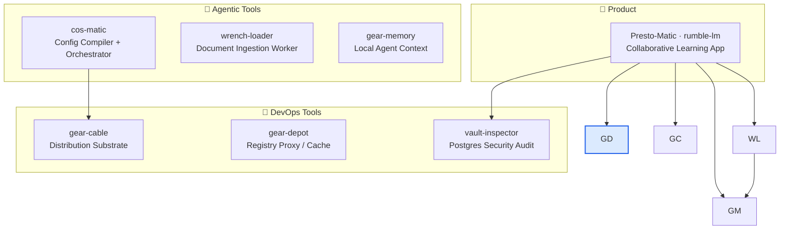

# gear-depot

> Sovereign registry proxy/cache with supply-chain policy enforcement across Cargo, npm, and PyPI — cached, inspectable dependency supply lines without hard-locking to public registries.

[](LICENSE)
[](https://www.rust-lang.org)
[](https://github.com/constantin-jais/gear-depot/actions/workflows/ci.yml)

> **Status:** `0.0.0` skeleton — boundary, upstream policy, and CI gates are explicit before implementation starts.

## Why it exists

A sovereign stack needs cached, inspectable dependency supply lines across ecosystems without hard-locking to public registries. `gear-depot` adds a controllable mirror layer: cache what you rely on, enforce license and vulnerability policy, and eliminate the single-registry SPOF.

## Ecosystem



## Contract

|             |                                                       |
| ----------- | ----------------------------------------------------- |
| **Proxy**   | Native package-manager endpoints for Cargo, npm, PyPI |
| **Policy**  | License, yank, and vulnerability severity reports     |
| **Storage** | Filesystem or S3/Cellar-compatible object storage     |

## Non-goals

- No immediate production-critical registry dependency
- No opaque binary mirroring without checksums
- No policy bypass for AGPL/SSPL/proprietary packages

## Upstream

|               |                                                                                                            |
| ------------- | ---------------------------------------------------------------------------------------------------------- |
| **Project**   | [Starmetal](https://github.com/Goldziher/starmetal)                                                        |
| **Policy**    | Upstream-first, pinned releases/commits, no permanent fork                                                 |
| **Fork rule** | Only for a blocking security/build/sovereignty patch; open the upstream PR and remove the fork once merged |

## Development

```bash
cargo fmt --all --check
cargo clippy --workspace --all-targets --all-features
cargo test --workspace --all-features
```

## Related projects

| Repo                                                                  | Role                                                |
| --------------------------------------------------------------------- | --------------------------------------------------- |
| [Presto-Matic](https://github.com/constantin-jais/rumble-lm)          | Sovereign learning platform — supply chain consumer |
| [cos-matic](https://github.com/constantin-jais/cos-matic)     | Config compiler and autonomous orchestrator         |
| [wrench-loader](https://github.com/constantin-jais/wrench-loader)         | Document ingestion worker                           |
| [gear-memory](https://github.com/constantin-jais/gear-memory)         | Local agent context layer                           |
| [gear-cable](https://github.com/constantin-jais/gear-cable)           | Multi-platform distribution substrate               |
| [vault-inspector](https://github.com/constantin-jais/vault-inspector) | Postgres security audit                             |

## License

MIT © Constantin Jais
